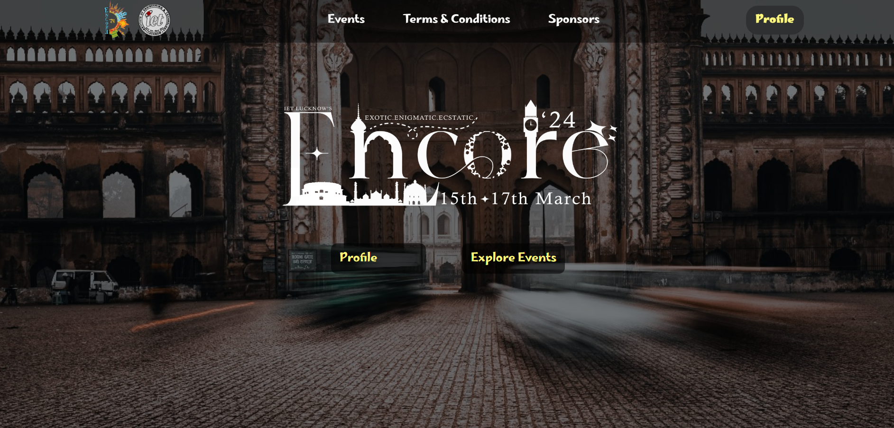
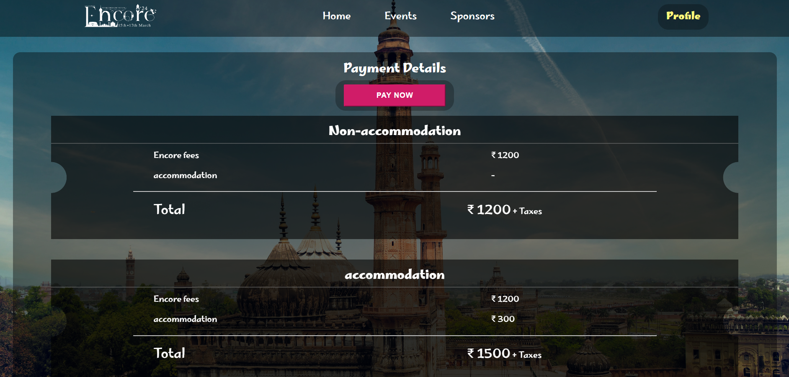
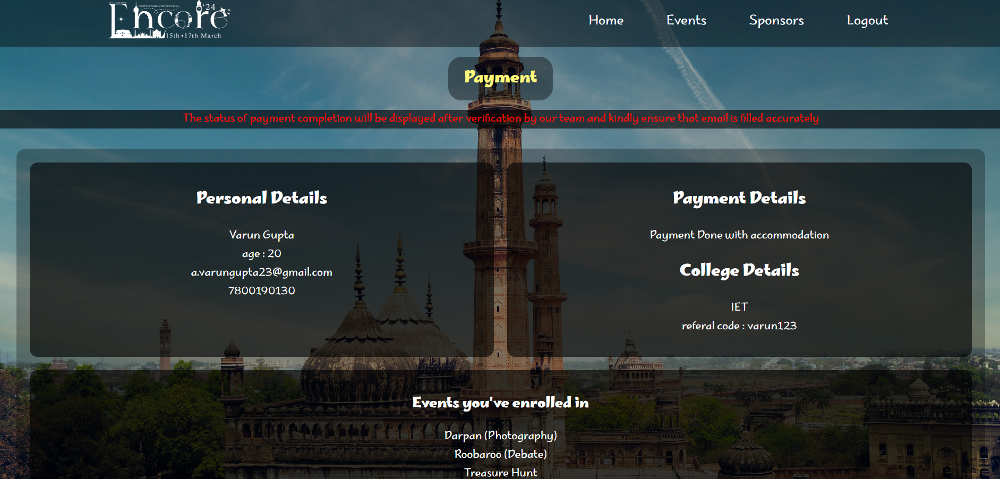
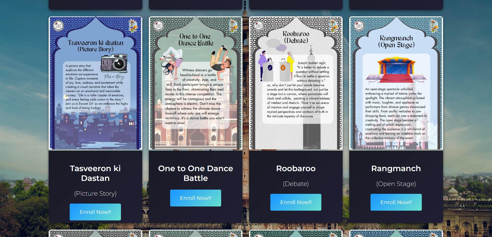
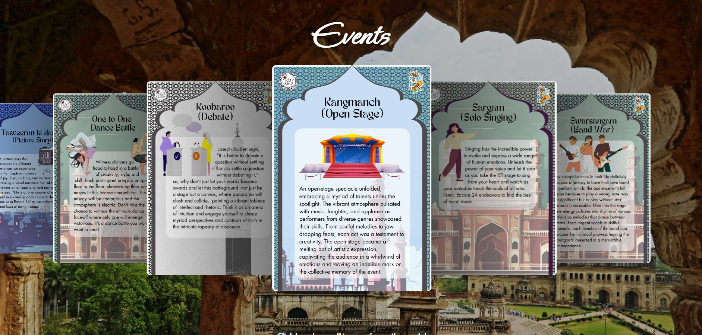
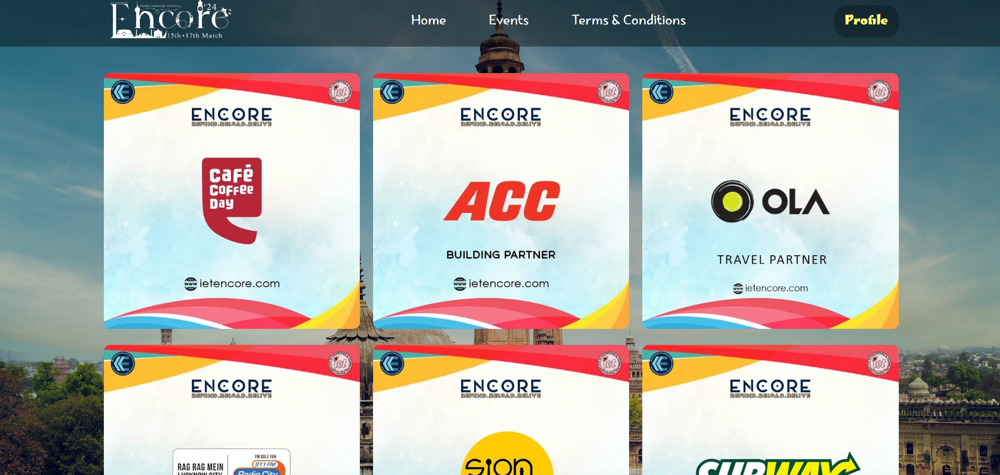
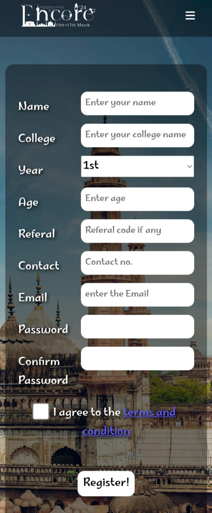
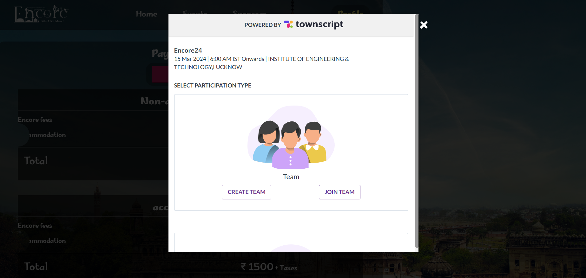

# Encore Website 2024

__Encore is an annual cultural fest organized by the Institute of Engineering and Technology, Lucknow. This repository contains the code and assets for the official website of Encore 2024, which includes multiple sections such as the Home page, Event details, Sponsor Information, terms and conditions, ticket booking, and user profiles.__

**The frontend of this website has been made by my juniors under my guidance and I have made its complete backend**

## Table of Contents
- [Home Page](#home-page)
- [Pricing Section](#pricing-section)
- [Profile Page](#profile-page)
- [Events Section](#events-section)
- [Sponsors Page](#sponsors-page)
- [Terms & Conditions Page](#terms--conditions-page)
- [Ticket Booking Section](#ticket-booking-section)

## Home Page

The home page provides an overview of the Encore festival, including dates, a brief description, and navigation links to various sections of the site.

## Pricing Section

The pricing section offers details on the ticket options available for attendees, including prices for accommodation and non-accommodation tickets.

### Ticket Options:
- **Non-accommodation:** ₹1200 + Taxes
- **Accommodation:** ₹1500 + Taxes (₹1200 + ₹300 for accommodation)

## Profile Page

The profile page displays personal details of the user, payment status, college details, and the events the user has enrolled in.

### Example:
- **Name:** Varun Gupta
- **Age:** 20
- **Email:** a.varungupta23@gmail.com
- **Phone:** 7800190130
- **Payment Status:** Done with accommodation
- **College:** IET
- **Referral Code:** varun123
- **Enrolled Events:** Darpan (Photography), Roobaroo (Debate), Treasure Hunt

## Events Section

Details about 35+ various events that will be held during the Encore festival. Each event has its own description, rules, and registration details.

## Sponsors Page

Information about the sponsors who are supporting the Encore festival. This section acknowledges their contributions and provides their logos and links to their websites.

## Register Page

<!--  -->

  

This is the Signup page where users have to fill in their and their college details before registering their events.

## Ticket Booking Section

The ticket booking section allows users to purchase tickets for the Encore festival. It provides options for accommodation and non-accommodation tickets, and includes a payment gateway from [Townscript Website](https://www.townscript.com/in/india) for completing the transaction.

---

visit the [Encore 2024 Website](https://encore2024.example.com).

